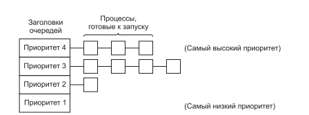

# **1** Процессы и потоки

## Различные требования

Виды О.С.

- Реального времени — системы требующие строгого соблюдения сроков выполнения. Например заводы, атомные электростанции или аппараты жизнеобеспечения.

- Пакетные (Серверные) — Акцентирующие внимание на обработку запросов от множества пользователей. Важнейшую роль играет соотношение обработанных запросов за единицу времени и время ожидания. Пример системы: Веб-серверы, банковские системы

- Интерактивные (Пользовательские) — Система в которой в подавляющем большинстве времени работает один пользователь. Следовательно, наивысший приоритет получает процесс с фокусом. Соответственно примером служит, ПК.

## Алгоритмы планирования

Для систем реального времени расчёт идёт на наихудший случай. Следовательно высчитывают максимально неудачный\загруженный момент процессора в котором все процессы поступили одновременно и выстраивают систему так что бы процессор не был загружен на 100%.

Так же бывают системы мягкого реального времени, когда допускается небольшое запоздание в вычислениях с целью сэкономить и не покупать огромное число вычислительных элементов.

В пакетных системах ситуация иная. Наиболее выгодным на данных момент является комбинация кольцевого и приоритетного планирования. Как показано на рисунке ниже:

Сущность алгоритма распределения сводится к следующему: Процессы разбиваются на группы, с разными приоритетами. О.С. Запускает по циклу процессы с наивысшим приоритетом. После того как выделенное им время закончилось, их приоритет понижается. И  цикл продолжается с процессами уровнем ниже. Этот алгоритм применяется в Linux.

Зачем добавлять приоритеты в системах где важно количество обработанных пользователей? Поскольку без этого процессы требующие несколько миллисекунд,  будут вынуждены ждать прохождения абсолютно всех процессов.

В пользовательских системах, более 90% процентов процессорного времени отдаётся процессу с фокусом ввода, а остальные процессы получают ресурсы процессора с помощью алгоритмов пакетного распределения.