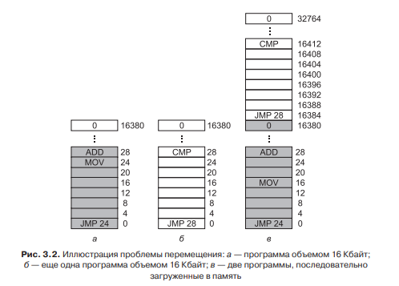
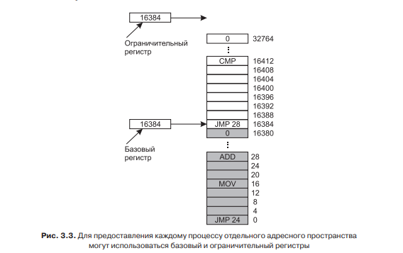
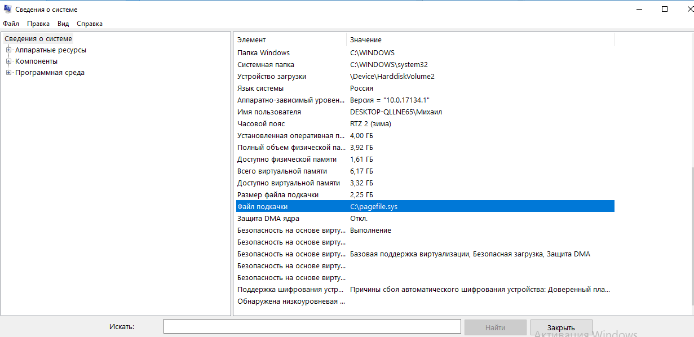
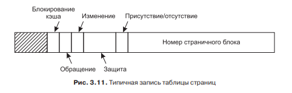
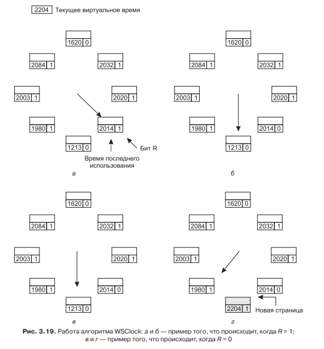
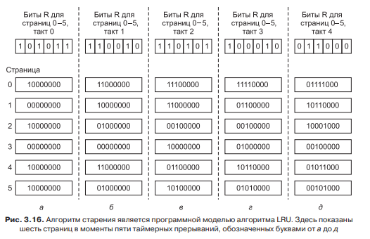
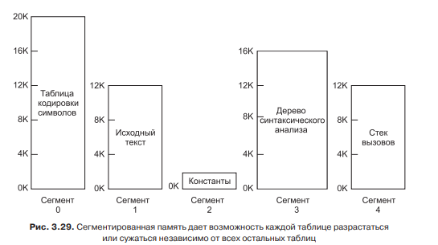
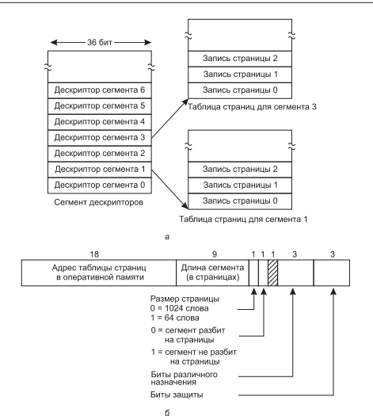
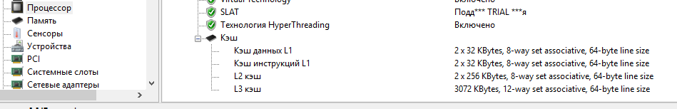

# **2** Управление паматью

## Виртуальная адресация

Внедрение виртуальной адресации нужно из следующих соображений.

Как показано на рисунке выше, две программы были загружены последовательно в оперативную память. При выполнение второй будет следующая проблема. При выполнении команды условного перехода на ячейку 28, она попадёт в программу 1 и выполнятся начнётся уже код первой программы. Для решения этой проблемы был добавлены следующие регистры.

Базовый регистр это регистр начала программы, а ограничительный это её конец. При команде перехода к адресу добавляется значение базового регистра. Всем этим занимается виртуальный менеджер памяти (mmu). Он контролирует любое обращение к памяти.

## Кеш и виртуальная память

Кеш реализует принцип «То чем пользуешься чаще, держи ближе». Для реализации кеша используются память внутри процессора. Если нужно заполучить какую-то информацию, сначала проверяется есть ли она в кеше, если есть, она считывается оттуда. Если нет, она считывается из оперативной памяти, и записывается в кеш.

Виртуальная память(Не адресация, а именно память) реализует противоположный принцип «То чем пользуешься редко, держи подальше». Если места в оперативной памяти не хватает, то те части программы которые используются наиболее редко, помещаются в файл. В Windows 10 этот файл имеет путь:

## Страничная организация памяти

Страничная организация памяти подразумевает , что некоторые части программы используются значительно реже других. Поэтому нужно разделить программу на страницы и держать в память те, которые используются чаще, а то что используются реже, отправить в виртуальную память. Средний размер страниц составляет 4К. Следовательно при 4Г оперативной памяти, будет около 1 млн. страниц. Для организации работы с такой системой, была введена таблица страниц. Типичная запись в ней проиллюстрирована ниже:

Она содержит служебную информацию, из которой нам будет важен бит R(Read), указывающий на то, было ли обращение к странице. Помимо служебной информации, она содержит номер страницы на которую указывает. Следовательно при попытке считать страницу для кеширования(помещения её в кеш), проверяется вся таблица страниц, ищется та запись которая хранит нужный номер страничного блока. Потом по этому номеру, считывается страница и помещается в кеш.

## Алгоритмы замещения

Встаёт вопрос. При записе страницы в кеш, её нужно записать на место наименее использовавшейся. Как узнать какая страница наименее используется? Этим занимается алгоритмы замещения. На данный момент используется чаще всего два алгоритма. Первый WSClock. Его работа проиллюстрирована ниже.

Этот алгоритм реализован из следующих соображений. Если бит R = 1(то-есть, страницу читали), то её скорее всего будут читать ещё. Поэтому когда программа проходит по всем страницам, она ищет страницу с битом R = 0. И записывает туда новую. А если находит страницу с R = 1. Она сбрасывает этот бит в 0, что бы информация об использовании не устаревала. Если же все биты в таблице страниц = 1. Тогда при втором проходе сравнивается время последней записи и заменяется наиболее старая.

Так же следует заметить что существует модернизация алгоритма. Она заключается в запуске фонового процесса, называемого демоном памяти. Его задача заключается в том что бы проходя по процессам заменять в них старые страницы на новые. Разница в том, что он это делает не по необходимости запроса страницы, а фоном сам. По существу к часам просто добавляется ещё одна стрелка.

Другим алгоритмом является алгоритм старения. Его работа показана ниже:

К каждой странице добавляется байт служебной информации. При обращении (То-есть, когда бит R ставится в 1), он заносится в самый левый бит. А все другие при помощи сдвига перемещаются вправо. При выборе страницы на выселение, значение этого байта сравниваются как обычные числа. Этот алгоритм реализует принцип наиболее актуальной информации. Если в данный момент в двум страницам не было обращений, то роль играют их прошлая история.

## Сегментно-страничная организация памяти

Очевидным недостатком страничной организации памяти это огромное число записей в таблице страниц. При переборе миллиона записей, уйдёт неприемлемое время. Так же нужно контролировать рост программ. Решение этой проблемы в добавлении сегментов.

На рисунке выше показана количество байтов требуемое компилятором. Из него видно что, мало того что одни части значительно больше других, они и изменятся будут с разной скоростью. Константы вообще не будут. Текст программы будет расти, а стек вызовов, будет изменятся непредсказуемым образом. Логичным было выделить для разных частей разное количество памяти, а не один набор страниц для всей программы. Ниже это решение проиллюстрировано.

Теперь добавляется новый уровень иерархии. Для каждой части программы ведётся своя таблица страниц. Эти части называются сегментами. И ведётся таблица для описи таблицы страниц. К примеру возьмём 32-разрядное адресное пространство. 12 бит, нужно для указания байта внутри страницы. 11 для количества записи в таблице страниц и допустим 9, для количества сегментов. Получается 512 сегментов, 2048 страниц и 4К занимает одна страница. Следует заменить что в современных 64-разрядных компьютерах, используется тоже три уровня иерархии. Только используются не все биты. К примеру 48 бит хватит что бы описать 256ТБ оперативной памяти. Этого на данный момент достаточно.

Следует отметить, что на данный момент используется ещё одна модернизация. Помимо загрузки и выгрузки данных из таблиц по мере необходимости. Существует ещё отдельный модуль TLB. Он кеширует непосредственно страницы, без посредника в виде адресов сегментов и таблиц

## Всё в месте

Если у программы был запрос на адрес 0x00801001. А соотношение сегмент, колво страниц, длина страницы(9,11,12). То этот запрос обозначает доступ к первому сегменту, первой страницу, первому слову. Потом к этому слову добавляется значение базового регистра. И если полученный адрес пропустят модули безопасности, то этот адрес успешно передастся на шину.

Так же следует отметить, что в современных процессорах иногда реализован принцип разделения данных и команд. Вот пример кеша первого уровня у моего процессора.

Это сделано из следующих соображений. Текст программы, в отличие от данных изменятся не будет. Следовательно перед стиранием его из кеша, копию в оперативной памяти обновлять не нужно. Из-за этого не нужно переключатся между процессами.