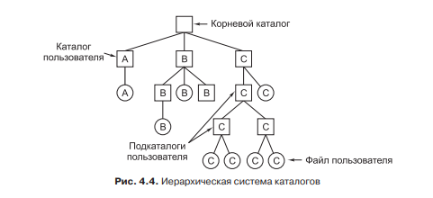
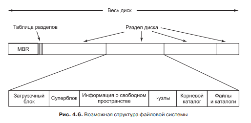
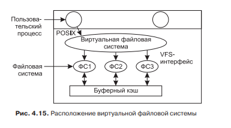
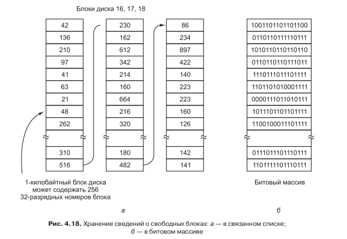
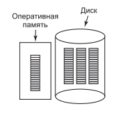
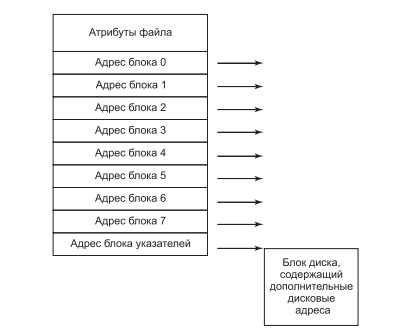
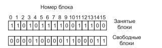
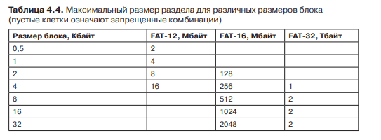

# **3** Файловые системы

## Понятия

С точки зрения пользователя файловая система выглядит следующим образом:

Каталоги это папки.

Файловая система с точки зрения программиста представляет организацию памяти на накопителе и предоставление к ней доступа программам, посредством стандартного интерфейса. Стандарт POSIX предоставляет такой интерфейс, помимо прочего в него включены такие системные вызовы как(open – открыть файл, read — прочитать из файла, write — записать в файл,close — закрыть файл). И так же многое другое. Любая файловая система должна предоставлять все эти системные вызовы.

## Основа

Независимо от файловой системы при разделение диска на логический разделы, используется стандартный принцип. Он продемонстрирован ниже:

MBR, это программа которая находится в самом начале памяти и запускается BIOS-ом при включении компьютера. За ней следует таблицы разделов, указывающие каким образом был разбил жесткий диск. MBR находит в этой таблице информацию о том, в каком разделе находится О.С. Запускает её и передаёт тем самым управление.

Недостатком такой системы будет то, что она работает только с диском объёмом до 2ТБ. Поэтому сейчас она заменяется на GPT.

## VFS
Так как необходимо что бы устройства с разными файловыми системами, были совместимыми. Для этого существует VFS(virtual file system ).

Работает по следующему принципу — когда внешнее запоминающее устройство подключается в компьютеру, оно связывается с VFS и предоставляет набор функций для работы с этим запоминающим устройством. Потом когда программа на компьютере хочет допустим открыть файл, она делает системный вызов, который передаётся VFS. АVFS в свою очередь вызывает функцию open, которая была передана ранее.

## Отслеживание свободных блоков

Файловые системы вне зависимости от структуры, так или иначе делят накопитель на логические части, называемые блоками. Некоторые будут заполнены информацией, а некоторые нет. Когда программа хочет создать файл и записать в него информацию, она делает системный вызов create. Операционная система должна найти свободное место на диске и предоставить программе указатель на него. Очевидно что при современных объёмах памяти, последовательно просматривать диск нерационально. Для избежание этого используют два метода. Связанный список и битовый массив.

И оба делят диск на блоки. Битовый массив выделяет для каждого блока в оперативной памяти один бит и устанавливает его в 1 если блок занят. К примеру при размере блока 1КБ и жестком диске 1ТБ, битовый массив будет занимать 128МБ оперативной памяти.

Другой способ, это создать связанный список. В котором хранятся адреса свободных блоков, а в конце списка указатель на другой такой же список.

И недостаток и достоинство битового массива в том, что независимо от количества свободных блоков он будет занимать фиксированный размер.

Так же следует отметить, что не весь список или битовый массив постоянно хранится в памяти, он записывается на диск на место тех самых свободных блоков, а в оперативной памяти  содержится только часть.

## Блоки указателей

Для хранение информации о том, какие блоки выделены конкретному файлу, часто используется таблица I-узлов. В начале которой данные характеризующие файл, посередине адреса блоков, а в конце если понадобится ссылка на следующую такую таблицу, если все адреса не умещаются.

## Непротиворечивость файловой системы

Если какая либо из операций работы с файлом была завершена некорректно, то может потеряться блоки данных. То-есть, в таблицы i-узлов, не один адрес не будет ссылаться на эти блоки, а в структурах данных для отслеживания свободных блоков будет помечаться что блок используется. Для контроля таких ситуаций в О.С. Windows есть программа fsc. Она следить за состояние блоков, и ведёт таблицу показанную ниже:

В данном случае блок 2 был утерял. Он не является ни свободным не занятым. В таких ситуациях этот фоновый процесс делает его свободным.

## Резервное копирование

При резервном копировании файловой системы. Используется следующий метод. Копируется не каждый блок, а состояние иерархии каталогов и файлов. Так же в отдельные файлы могут записываться изменения, что бы при обновлении резервной копии не переписывать всё заново.

## Кеширование

Алгоритмы кеширования файлов преследует такие же цели, как и алгоритмы замещения страниц оперативной памяти. И использует те же алгоритмы. Но есть и отличия. К примеру для модификации кеширования, используется опережающее чтение. То-есть, при считывания байта k из файла, фоновый процесс считает и байт k + 1. Так же может использоваться алгоритм сквозной записи. То-есть, изменения в файл вносятся не при его закрытии, и при любом изменение. Это существенно снижает производительность, зато так же повышает надёжность.

## FAT

Конкретным примером файловой системы служит семейство файловых систем FAT.

Каждая из файловых систем FAT позволяет разделить диск на 4 логических раздела. Для отслеживание блоков памяти используются i-узлы. Максимальный размер логического диска в FAT 32 = 2ТБ. А просто диска 8ТБ, так как доступно 4 логических разделения.