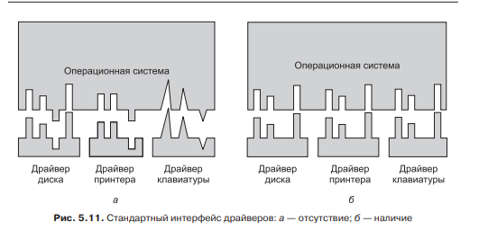
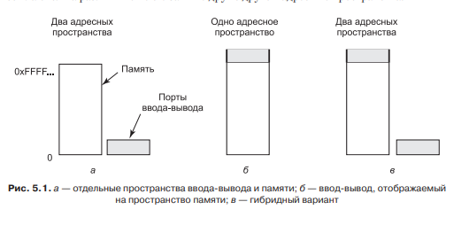
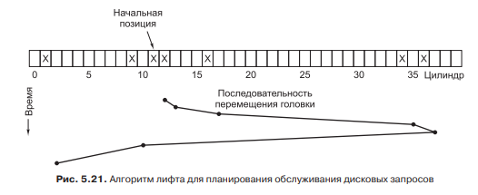

# **3** Ввод и вывод информации

## Контроллер

Общий принцип устройств ввода  и вывода следующий. В устройство встраивается преобразователь сигнала в двоичный, он называет контроллер. К примеру в клавиатуре при нажатии клавиши, на контроллер передаётся сигнал с одного из многочисленных проводов под клавишами и преобразовывается в двоичный код. Этот код в свою очередь передаётся на материнскую плату, для дальнейшей обработки.

## Драйверы

Когда двоичный код поступает на материнскую плату. Он начинает обрабатываться специальной программой созданной для этого устройства, которая называется «Драйвер». Зачем он нужен? Так как в некоторый случаях важен не только код нажатой клавиши клавиатуры или допустим мыши, но и контекст. То-есть, Shift + V и V не одно и тоже сочетание. И драйвер должен преобразовывать двоичный код с учётом этого контекста. Так же при желании можно вносить модификации. К примеру для некоторых программ важно нажата цифра в верхней полосе или в боковом прямоугольнике. Но такая проверка тратит ресурсы, поэтому разработка драйвера зависит от контекста.

Так же существует определённый стандарт разработки драйверов, для совместимости с разными операционными системами, это проиллюстрировано ниже.

## Программный ввод вывод

Когда программе нужно запросить данные с устройства или вывести их в него, существует несколько нюансов. Существует пространство портов ввода вывода, и при обращение ассемблерные команды указывают на номер порта указанного устройства.

Так же существует возможность проецировать пространство портов на оперативную память и при обращении указывается адрес оперативной памяти, а при выполнении он заменяется на порт. Тогда не нужна таблица портов, но теряется часть оперативной памяти, так как обратится к ней будет нельзя. Ведь команды которые будут к ней обращаться, обратятся к портам. Это показано ниже.

## Диск

При работе с диском контроллер открывает дополнительные возможности. Одним из примеров служат RAID массивы(Дописать). Так же следует отметить, что в контроллере присутствует буфер команд на чтение. Что бы сэкономить время прокрутки диска используется принцип лифта. Сначала выполняются все команды чтения в одном направлении, потом в другом. В ssd накопителях данной потребности нет.

## Мыш

Контроллер мышки отслеживает перемещение лазера и кодирует его в значение 'x' и 'y', которое обозначает относительное изменение положение по этим координатам.

## Растр

Вывод на экран осуществляется приданием цветов каждому пикселю. Данные которые кодируют цвет подаются на контроллер монитора, и в дальнейшем выводятся на него.

## Энергопотребление

Операционная система так же может контролировать энергопотребление. Это делается в основном за счёт выключения отдельных частей компьютера после определённого периода простоя. Помимо этого можно снизить нагрузку на центральный процессор. Было выявлено что производительность процессора пропорциональна напряжению, а энергия является квадратом от напряжения. Следовательно понизив напряжение вдвое, мы снизим потребление энергии в четыре раза. Однако при это производительность будет вдвое меньше.

Следовательно экономия в два раза.