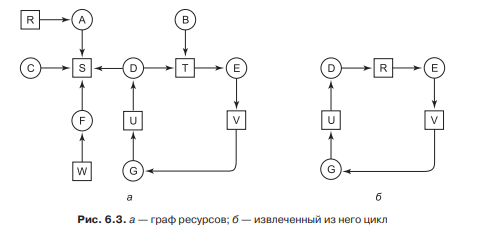
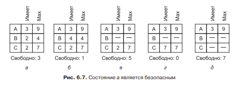

# **5** Взаимоблокировка

## Определение

Взаимоблокировка, это когда в наборе из нескольких процессов два или более из них, не могу продолжить работу из-за того что ждут другой процесс. Например, процесс 1 хочет получить доступ к принтеру, которым владеет процесс 2, а сам процесс 1 владеет допустим сканером. А процесс 2 наоборот, хочет заполучить сканер, а сам владеет принтером. В итоге они будут ждать друг друга, а следовательно оба не закончат работу.

Так же цепочки могут состоять из более чем двух процессов, а значит и все эти процессы не смогут закончить работу.

## Требование

Существует четыре требования необходимые для того, что бы в операционной системы могла возникнуть взаимоблокировка. Они показаны ниже:

1. Условие взаимного исключения. Каждый ресурс либо выделен в данный момент только одному процессу, либо доступен.

2. Условие удержания и ожидания. Процессы, удерживающие в данный момент ранее выделенные им ресурсы, могут запрашивать новые ресурсы.

3. Условие невыгружаемости. Ранее выделенные ресурсы не могут быть принудителыю отобраны у процесса. Они должны быть явным образом высвобождены тем процессом, который их удерживает. 

4. Условие циклического ожидания. Должна существовать кольцевая последовательность из двух и более процессов, каждый из которых ожидает высвобождения ресурса, удерживаемого следующим членом последоватености.

Если хотя бы одно условие не соблюдается, то взаимоблокировки в системе не будет.

## Классификации

Взаимоблокировки бывают ресурсные и коммуникационные. Первые возникают в следствии взаимного ожидания получении чего либо. А вторые в следствии недоступности сигналов. Примером вторых может случить автономная система, в которой маршрутизаторы передают фреймы по кругу, из-за неправильного адреса.    

Так же ресурсные делятся на два типа, те в котором существует только один экземпляр ресурса или несколько экзмепляров.

## Методы обнаружения

В случае когда в системе имеется только один экземпляр каждого ресурса, выявить взаимоблокировку можно следующим образом. Если изобразить процессы и ресурсы в виде вершин, а запрос ресурса в виде рёбер,  то можем получить граф изображенный ниже.

Поиск взаимоблокировки в данном графе сводится к поиску цикла.

## Методы предотвращения

Если ресурс используется в нескольких экземплярах, то программой проверяется можно ли выдавать ресурсы. Это показано ниже:

Если выделить ресурсы в начале процессу не С, то каждый процесс будет заблокирован.

В случае если используется только один экземпляр ресурса, то используется алгоритм поиска на графах. В дальнейшем выбирается какой процесс из графа можно удалить, что бы исчез цикл.

Так же для предотвращения взаимоблокировок в принципе, используется двухфазный алгоритм. В нём каждый процесс перед получением доступа к ресурсам, в цикле проверяет свободны ли они, если свободны он их получает. Если же видит что эти ресурсы заняты или их проверяет другой процесс, цикл повторяется сначала. Недостатком этого алгоритма служит то, что не каждая программа может начинать своё выполнение сначала.

Как уже было сказано, если нарушить хотя бы одно условие взаимоблокировки, то её в системе не будет. Этим пользуются программисты следующим образом.

- Первое правило можно нарушить, сделав данные только для чтения.
- Второе правило можно нарушить, используя двухфазный алгоритм.
- Третье правило можно нарушить, разрешив отбирать у процесса ресурсы.
- Четвёртое правило можно нарушить, устанавливая нумерацию ресурсов. То-есть, в изначальном примере принтер запрещается запрашивать раньше сканера, или наоборот.