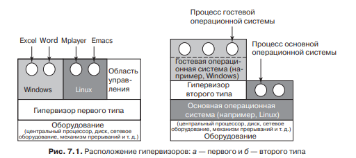
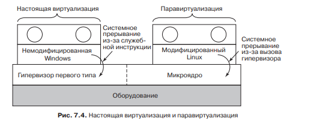

# **6** Виртуализация и облако

## Определение

Виртуализация представляет собой удалённое управление каким либо ресурсом компьютера.

## Типы

Неодноранговые и одноранговые. В первом случае запускается главная программа «гипервизор», а по верх неё две операционные системы. Пространство пользователя имеет уровень защиты 2, ядро 1, а гипервизор 0. Во втором случае, просто на основную ОС, ставится гипервизор, просто как программа и она в свою очередь контролирует другие ОС. В данном случае пространство пользователя гостевой ОС, имеет уровень защиты 3, ядро 2, гипервизор, так как работае на уровне пользователя основной ОС, уровень 1. А ядро 0. Уровни защиты играют следующую роль. Кольцо защиты с большим числом, не имеет власти над ресурсами той части, которая имеет уровень защиты меньше. И при попытке внести изменения, происходит передача контроля уровню ниже, для проверки на дозволенность таких действий.
	

Так же выделяют в отдельный подвид паравиртуализацию. Это когда виртуальная ОС, знает о том что она виртуальная и это влияет на ход работы.

## Виртуализация памяти

При виртуализации памяти нужно учитывать то что доступ к памяти могут иметь несколько ОС. Если одна ОС хранит соответствие виртуальной странице 1, физическую страницу 1, то вторая ОС не может выгрузить эту страницу или создать своё соответствие ей. Для этого используется теневая таблица страниц, определяющая какие виртуальные страницы виртуальной ОС, соответствуют физическим страницам. Этим занимается гипервизор.

## Виртуализация ввода-вывода

Для виртуализации ввода-вывода используется специальных механизм двухуровневого интерфейса. Внешний интерфейс представляет набор API к которым обращается драйвер гостевой ОС. Внутренней реализовал гипервизором и представляет интерпретатор каждого запроса.