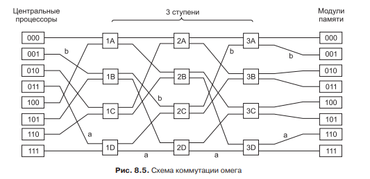
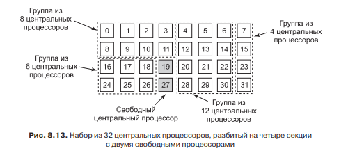
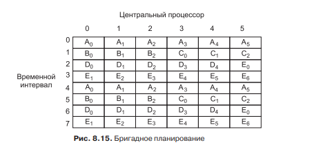
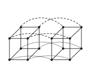
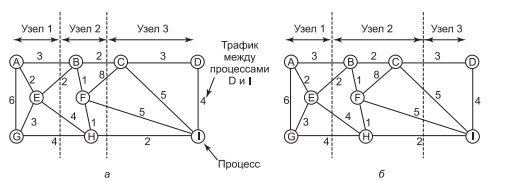

# **7** Многопроцессорные системы

## Мультипроцессоры

Мультипроцессором называют вычислительную систему с двумя или более процессорами и одной материнской платой. Для передачи данных между ними, используются коммутаторы. При передачи данные из оперативной памяти хранится трёхбитовый ключ, который адресует получателя. И коммутатор каждого уровня извлекает по одному биту и передаёт сообщение по одному из двух узлов.

Алгоритмы планирования в многопроцессорных системах, следующие. Так как каждый процесс сохраняет необходимые для себя данные в кеше, то предпочтительнее будет что бы в дальнейшем процессы не меняли свои процессоры. Поэтому первый алгоритм заключается в том, что при выборе на каком процессоре запускать поток, выбирается тот, на котором он был запущен раньше.

Так же некоторые процессы могут запускать потоки которые нуждаются в обмене данными. Так как у процессоров может быть общий кеш, то иногда используется метод островов. Он показан ниже:

Мультипроцессорная система разделена на острова, где в пределах одного острова процессоры имеют общую память. Недостатком такой системы является отсутствие изменений в разбиение.

Другой вариант это использовать алгоритм «бригадного планирования». Он заключается в том, что бы планировщик старался при каждом запуске запустить потоки из одного процесса.

Достоинством данной схемы является то, что если потоки нуждаются в частом обмене данными, то при использовании общей памяти, это будет осуществлено. Недостатком является то, что в данной схеме будет иметь низкую продуктивность кеш.

## Мультикомпъютеры

У мультипроцессорных систем имеется плохая масштабируемость. Для решения этой проблемы используются набор мультипроцессоров, связанных между собой каналами связи, имеющие скорость меньше чем скорость передачи данных внутри мультипроцессора. Так же каждый мультипроцессор имеет индивидуальную память. Такая система называется мультикомпьютер.

	
Передача данных из любого мультипроцессора к любому другому, будет происходит максимум за количество передачи k = log2N .  (где N  количество процессоров). При добавлении новых процессоров схема соединений должна будет включать новые измерения.

Что бы снизить передачу данных между мультипроцессорами алгоритм планирования мультикомпьютера работает по следующему принципу.

Берётся набор процессов которые обозначают вершины графа, и передача данных между ними обозначает рёбра. Алгоритм планирования ищет такой способ разрезания графа, что бы количество весов рёбер который были разрезаны, стало минимальным.

## Балансировка нагрузки

Для балансировки нагрузки используется алгоритм «инициированный получателем». Он заключается в том, что процессор когда видит что у него мало нагрузки, по очереди опрашивает другие процессоры, и при обнаружении перегрузки забирает один процесс себе.