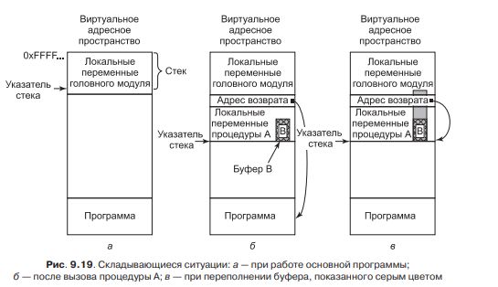
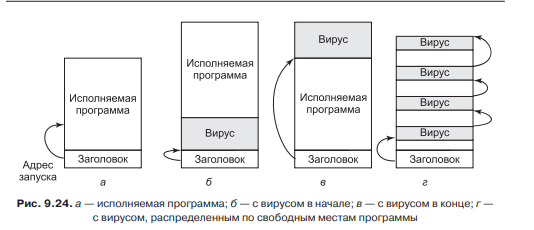
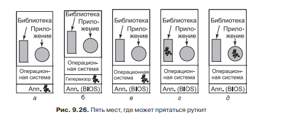
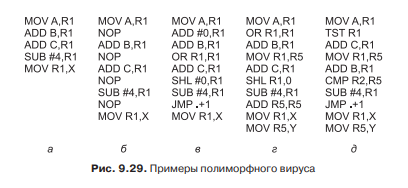
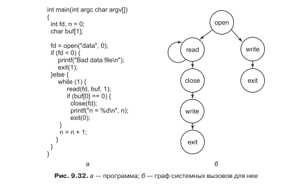
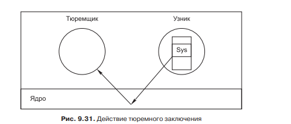

# **8** Безопасность

## Организация доступа

Для организации доступа к объектам в памяти (файлам, принтерам, библиотекам) в операционной системе используется двойной массив, где столбцы это объекты, а сроки пользователи. Сами ячейки хранят три бита разрешения (Запись, чтение, выполнение). Для оптимизации на диске, они могут хранится разрезавшись либо по строкам либо по столбцам.

## Виды атак

Атака переполнения буфера.



Как показано на рисунке выше, данные растут вверх по стеку. И если ввести больше определённого значения, то они запишутся вместо служебной информации. Ниже показан пример уязвимого для данной атаки кода:

```cpp
void A() {
	char B[128]; /* резервирование в стеке буфера объемом 128 байт */
	printf ("Type log message:");
	gets (B); /* чтение сообщения со стандартного ввода в буфер */
	writeLog (B); /* вывод строки в файл журнала */
}
```

При кибер-атаке данная уязвимость используется следующим образом. Перезаписав в служебной информации адрес возврата. При завершении работы функции, она вернёт управление туда куда укажет хакер и выполнит код там. Защитой от этого является внедрение в данные бита указывающего на то, что данные могут быть либо записываемыми либо исполняемыми. Записанные данные в таком случае будет не исполняемыми и выполнение хакерского кода не осуществится.

Улучшенная атака переполнения буфера заключается в следующем. Хакер составляет внедряемую программу не сам, а собирает из готовых библиотечных функций, в таком случае бит записи не будет изменён, и ОС разрешит выполнения кода.

В ответ на это ОС, добавило рандомизацию адресного пространства. Это означает что функции выгружаются в оперативную память по случайному адресу и хакер не может заранее знать на что будет ссылаться его код.	

Переполнение буфера может использоваться и в другом ключе. Ниже приведён пример кода.

```cpp
void A() {
	int author ized;
	char name [128];
	authorized = check credentials (...); /* атакующий не авторизован, поэтому возвращается 0 */
	printf ("Как вас зовут?\n");
	gets (name);
	if (authorized != 0) {
		printf ("Добро пожаловать %s, вот все ваши секреты \n", name);
		/* ... демонстрация секретных данных ... */
	} else {
		printf ("Извините, %s, но вы не прошли авторизацию.\n");
	}
} 
```

Данных код совершает проверку на правильность введённого имени. И при введении больше 128 символов, оставшиеся могут заменить переменную authorized. Хакер может этим воспользоваться что бы заменить её на 1 и войти в систему.

Атаки использующие форматирующую строку. Одна из перегрузок функции printf показана ниже:

```cpp
printf(g);
```

Хакер может передать ей строки содержащие форматы ввода, по типу %s %d и тд. Таким образом можно передавать и адреса перехода на функции.

Разыменование нулевого указателя. Этот вид атаки, помещает в переменную хранящую адрес функции нужное хакеру значение до инициализации переменной. Если ОС вызовет такую функцию по этому адресу, он выполнит код хакера.

## Виды вредоносных программ

Вирусы — это вредоносная программа которая изменяет загрузочную часть обычной программы, заставляя пользователя при запуске, запускать вирус. После отработки вирусом необходимых ему дел, он запускает программу к которой он был прикреплён, что бы не вызвать подозрений. Так же существует вариант, когда вирус прикрепляется к концу программы, и запускается перед её завершением. Различные варианты показаны ниже:



Черви — вредоносные программы основным свойством которых, является самокопирование.

Троянские кони — вредоносные программы, проникающие в ОС, прикрепляясь к файлу, который пользователь захотел скачать или установить.

Руткиты — вредоносные программы, имеющие хорошие способности к маскировке. Они могут прятаться в 5 местах, как показано ниже:



Так же стоит отметить, что вредоносные программы как правило попадают сразу под несколько категорий. То-есть, может встречаться вирус-червь и руткит одновременно.

## Защита от вирусов

Антивирусные программы хранят библиотеки с уже известными вирусами, и при сканировании компьютера на их обнаружение, они ищут соответствия. Так как большинство вирусов отличается в деталях, соответствие ищется не полное.

Вирусы при защите от антивируса используют следующие методы. Они добавляют ненужные вызовы что бы замаскировать свою сущность. Например добавляют к регистру 0 или умножают на 1. Такие вирусы называются полиморфными. Ниже приведены примеры 5 идентичных программ:



Ещё один способ борьбы с вирусами, это составление графа вызовов. При компиляции программы составляется граф вызовов ядра, и передаётся антивирусной программе. Антивирус при проверке программы, ищет не было ли вызвано что либо не из списка, если да, то программа заражена. Это показано ниже:



Ещё один способ анализа программ, это тюремное заключение или карантин.



Как показано на рисунке выше, антивирусная программа проверяет все системные вызовы, и если обнаружит недопустимые (например изменение загрузочной записи), то программа признаётся вирусом.