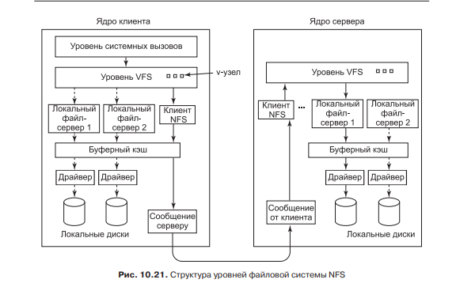
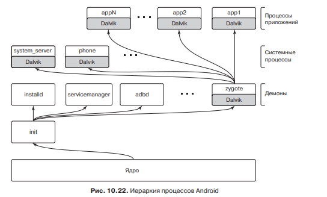
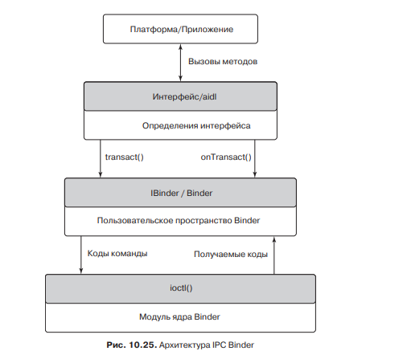
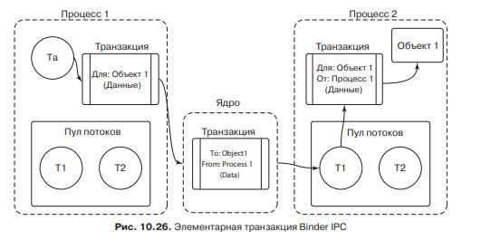
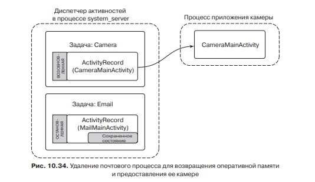

# **9** Изучение конкретных примеров: Unix, Linux и Android

## Linux

В Linux поддерживается иерархия процессов, поэтому все процессы произошли от единого предка процесса init.

## Алгоритм планирования

В андроид используется алгоритм планирования основанный на циклах и приоритетах. Более современные алгоритмы работают на основе чёрно-красный деревьев.

## Файловая система

Файловая система Linux работает следующим образом. При обращении к файлу с помощью операций определённых стандартом POSIX, операция передаётся VFS. VFS проверяет идёт ли обращение к локальному диску или к удалённому серверу. И передаёт управление соответствующей файловой системе.

Последняя локальная файловая система в Linux называется ext4. Она реализована на i-узлах и журналирование. Журналирование подразумивает сброс данных на диск не сразу, а после накопления в буфере(Журнале). Это позволяет свести к минимуму перемещение головок жесткого диска.
	
Сетевая файловая система в Linux называется NFS. При передаче команды к NFS, она с помощью протокола TCP передаёт запрос серверу. Основное отличие заключается в том, что сетевая ФС может не поддерживать указатели на позиции в файле. И читать данные можно сразу с любого места.

## Android. Процесс Java

Android основан на ядре Linux. В пространстве пользователя запускается виртуальная машина Java. А в ней уже большая часть приложений. Иерархия процессов показана ниже.

Процессы в Android обмениваются информацией с помощью транзакций, реализованных на системных вызовов Binder. Интерфейс Binder показан ниже:

Интерфейс приложения взаимодействует с модулем Binder, а он взаимодействует с ядром.

Пример такой транзакции показан ниже:

При сворачивании приложения вспомогательные данные (например положение прокрутки страницы) сохраняется в специальную область памяти процесса. Внизу приведён пример когда пользователь свернул приложение почты и зашел в камеру.

## Безопасность

Безопасность как в Android так и в Linux использует биты защиты которые указывают возможные действия над файлом. А в Android так же Java песочницу, в которой код не может выйти за пределы выделенной памяти. Так же приложению выделяются полномочия к ресурсам устройства по мере необходимости.